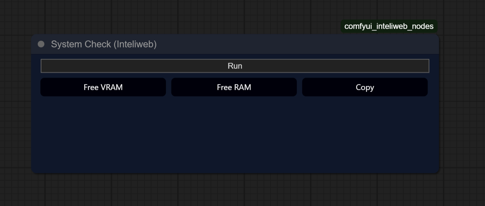
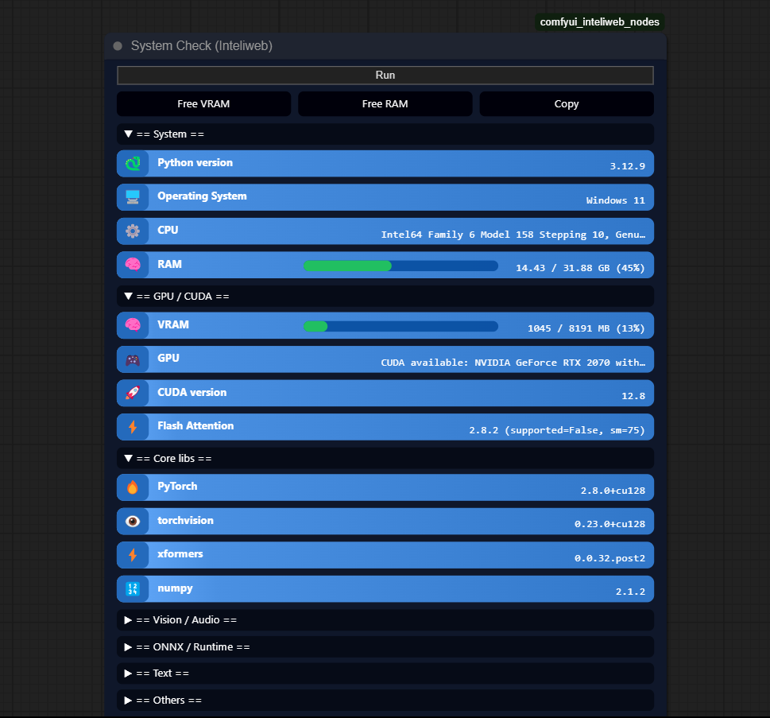
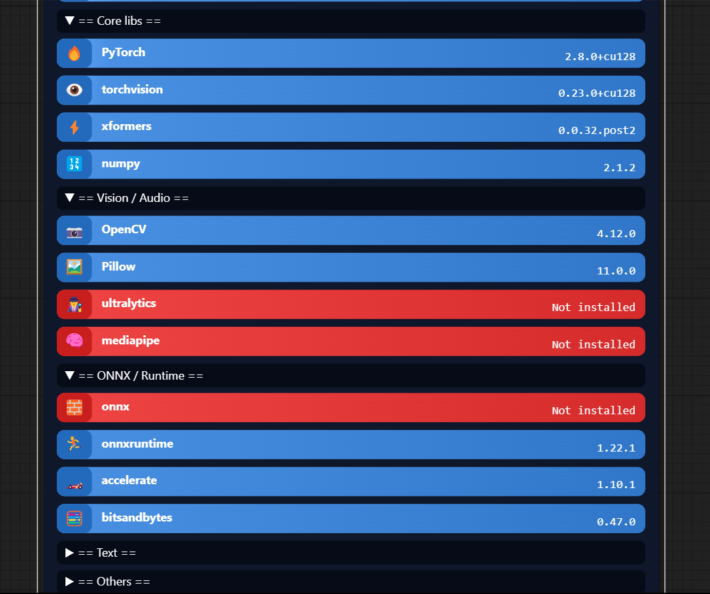
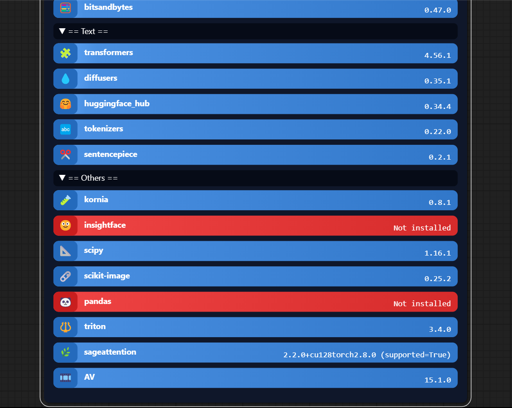
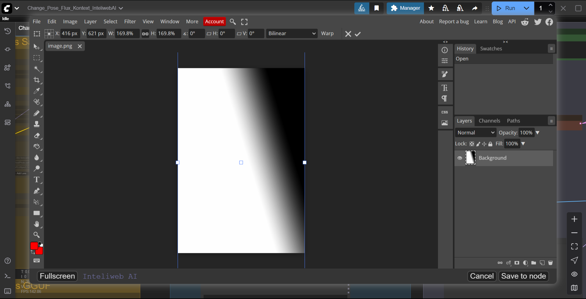

# comfyui_inteliweb_nodes

<p align="left">
  
  <a href="http://www.apache.org/licenses/LICENSE-2.0">
    
  </a>
  <a href="https://github.com/comfyanonymous/ComfyUI">
    
  </a>
</p>

> **System Check (Inteliweb)** — Nodo utilitario para ComfyUI que muestra información del sistema (OS/CPU/Python), detecta librerías clave de IA (PyTorch, torchvision, xformers, etc.), verifica Flash Attention y añade botones para **liberar VRAM** y **liberar RAM**. Incluye modo _Estilizado_ con badges y **auto-refresh de RAM/VRAM cada 1s**.

<div align="center">

**Colapsado (inicio)**  


**Expandido (después de Run)**  




</div>

---

## ✨ Photopea Editor (Inteliweb)

Integra **Photopea** dentro de ComfyUI:

- Menú contextual (**clic derecho**) en nodos con salida `IMAGE`/`MASK`: **Open in Photopea Editor**.
- Edición en modal con **Fullscreen** y opción **Save / Save to node**:
  - Sube el PNG a `/upload/image`, lo añade al **Clipspace** y si abriste desde un nodo, actualiza su widget `image` con `… [input]`.
- Implementación **sin dependencias Python** (solo JS en `web/`).
- Requiere conexión a internet (Photopea corre en el navegador).

<div align="center">

<!-- Coloca aquí tu captura del modal de Photopea -->


</div>

**Tips**

- Si trabajas con imágenes muy grandes, la apertura/guardado puede tardar unos segundos (normal en Photopea).

---

## Características

- Vista **Estilizada** con categorías colapsables (System, GPU/CUDA, Core libs, etc.).
- **Botones rápidos**: Free VRAM, Free RAM y Copy.
- **Barras de RAM/VRAM** con **actualización automática cada 1s** (end-point ligero, sin recalcular todo).
- Detección de **Flash Attention** (soporte/estado del paquete).
- **Photopea Editor (Inteliweb)** integrado (menú contextual + Clipspace + guardado al nodo).

## Instalación

> Requiere una instalación previa de [ComfyUI](https://github.com/comfyanonymous/ComfyUI).

**Opción A — ZIP**

1. En GitHub: **Code → Download ZIP**.
2. Descomprime el contenido en:  
   `ComfyUI/custom_nodes/comfyui_inteliweb_nodes/`
3. Reinicia ComfyUI.

**Opción B — Git clone**

```bash
cd /ruta/a/ComfyUI/custom_nodes
git clone https://github.com/maoper11/comfyui_inteliweb_nodes.git
```

Reinicia ComfyUI.

## Uso

1. Añade el nodo **System Check (Inteliweb)** al lienzo.
2. Pulsa **Run** una vez.  
   Desde ese momento verás las barras de **RAM/VRAM** actualizándose cada segundo.
3. Usa **Free VRAM** y **Free RAM** cuando quieras liberar memoria.
4. **Copy** copia un resumen en texto de la info mostrada.

### Uso de Photopea

- **Opción 1 (desde un nodo):** clic derecho en un nodo con salida `IMAGE/MASK` → **Open in Photopea Editor**.
- Edita en Photopea y pulsa **Save** (o **Save to node** si volviste desde un nodo).

> Nota: Photopea corre embebido en un iframe (en tu navegador). No se envía información a servidores del autor del nodo.

## Compatibilidad

- Probado en Windows y Linux (NVIDIA).

---

## Créditos

- **Photopea Editor (Inteliweb):** adaptación namespaced a partir de la idea de  
  [`coolzilj/ComfyUI-Photopea`](https://github.com/coolzilj/ComfyUI-Photopea) (licencia **MIT**).  
  Gracias a @coolzilj por el flujo original de integración.

---

## Licencia (Apache-2.0)

Este proyecto está licenciado bajo **Apache License 2.0**. Consulta el archivo `LICENSE` para el texto completo.  
**Sin garantías**; el software se distribuye “TAL CUAL”. El autor **no asume responsabilidad** por daños o pérdidas derivados del uso.

---

## Autor

**Mauricio Perdomo — Inteliweb AI**

- YouTube (tutoriales de flujos profesionales para ComfyUI):  
  **https://www.youtube.com/@InteliwebAI**
- Mentorías personalizadas 1:1 (ComfyUI, instalación optimizada, flujos avanzados, Character Sheet, VTON, Flux, etc.)
