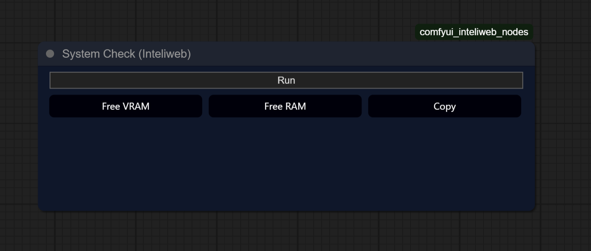
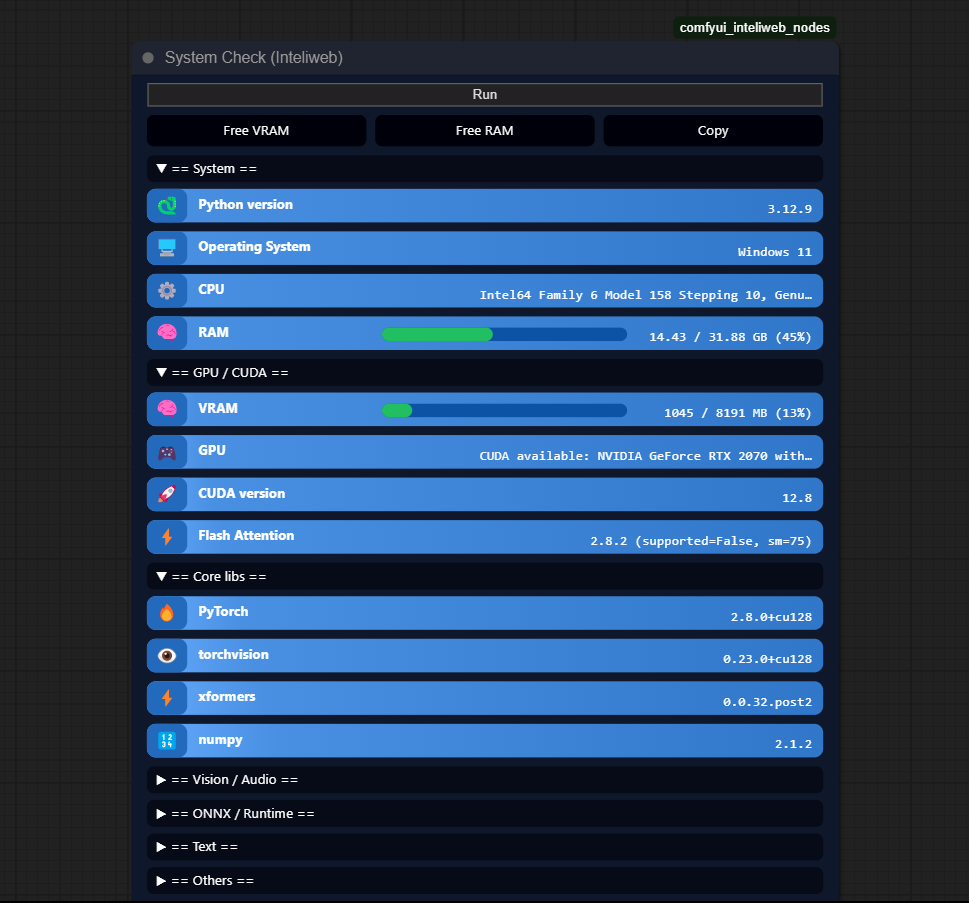
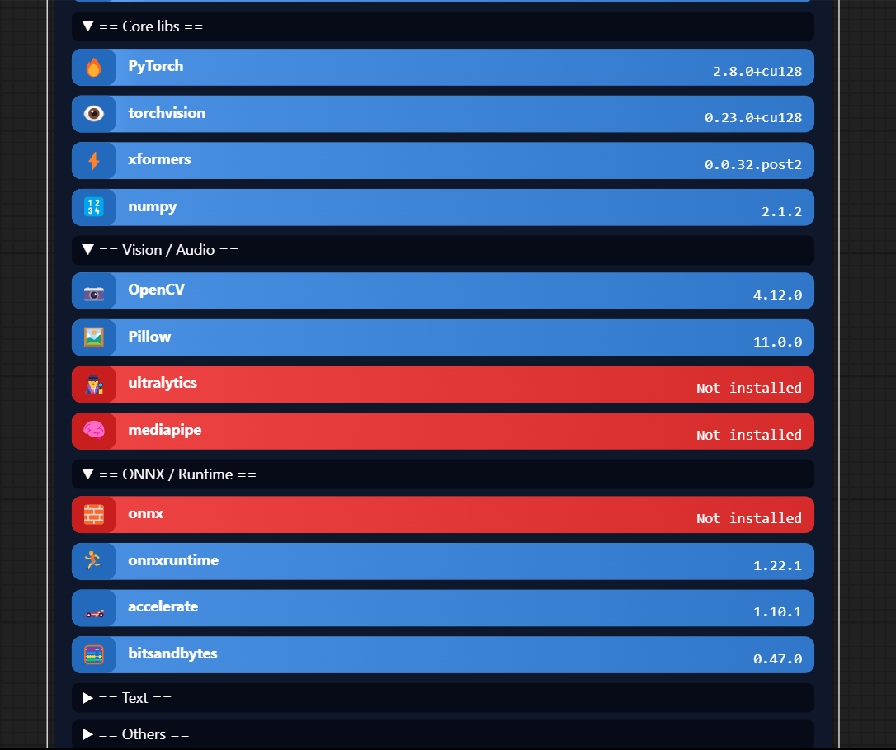
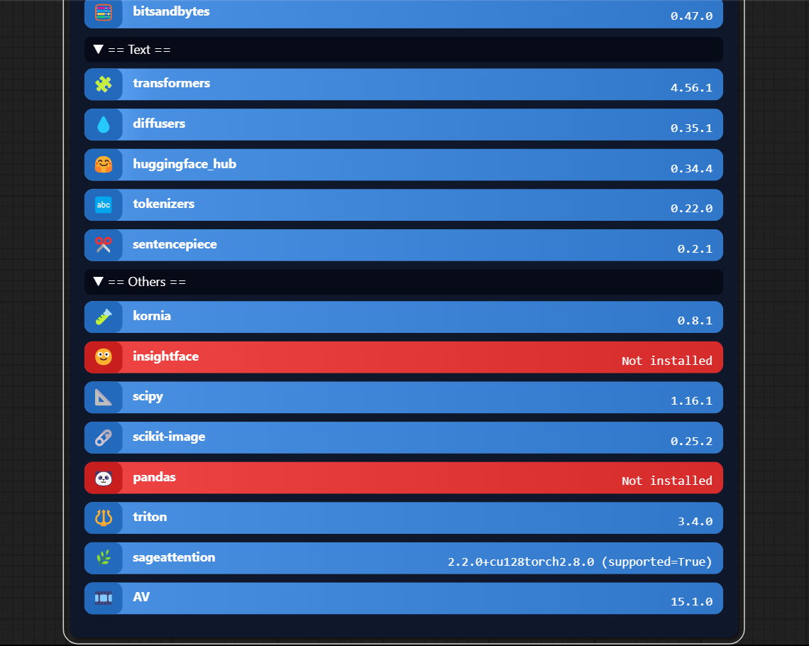
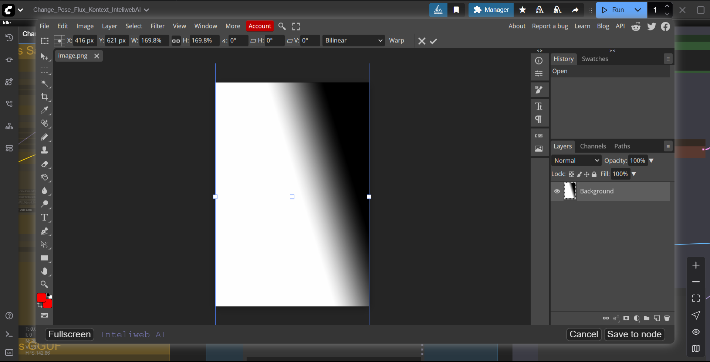

# comfyui_inteliweb_nodes

<p align="left">
  
  <a href="http://www.apache.org/licenses/LICENSE-2.0">
    
  </a>
  <a href="https://github.com/comfyanonymous/ComfyUI">
    
  </a>
</p>

> **System Check (Inteliweb)** — Nodo utilitario para ComfyUI que muestra información del sistema, detecta librerías clave de IA, verifica Flash Attention y añade botones para liberar VRAM y RAM.

<div align="center">

**Colapsado (inicio)**  


**Expandido (después de Run)**  




</div>

---

## 📊 Resource Monitor (Inteliweb)

Monitor compacto integrado en la barra superior de ComfyUI.

Muestra en tiempo real:

- Uso de disco.
- Uso de CPU.
- Uso de RAM.
- Utilización de GPU.
- Uso de VRAM.
- Temperatura de GPU.

Características:

- Intervalo configurable: 0.5, 1, 2 o 5 segundos.
- Cada indicador puede ocultarse individualmente.
- Tooltip con valores detallados y nombre de GPU.
- Soporte para múltiples fuentes de telemetría GPU:
  1. `pynvml`, cuando ya está instalado.
  2. `nvidia-smi`, sin instalar paquetes Python adicionales.
  3. PyTorch como fallback para medir VRAM.
- No inicia hilos de fondo: el navegador solicita snapshots mediante `/inteliweb/resource_monitor`.
- Implementación independiente de System Check.
- No añade requirements obligatorios.

Pulsa el botón `⋮` del monitor para cambiar su configuración.

> Cuando solo está disponible el fallback de PyTorch, se muestra VRAM pero la utilización y la temperatura pueden aparecer como `--`.

---

## ✨ Photopea Editor (Inteliweb)

Integra **Photopea** dentro de ComfyUI:

- Menú contextual en nodos con salida `IMAGE`/`MASK`: **Open in Photopea Editor**.
- Edición en modal con **Fullscreen** y opción **Save / Save to node**.
- Implementación sin dependencias Python.
- Requiere conexión a internet porque Photopea corre en el navegador.

<div align="center">

</div>

---

## 🧹 Free Memory (Inteliweb)

Nodo pass-through para liberar recursos entre etapas pesadas de un workflow. El ID interno continúa siendo `InteliwebPurgeVRAM` para conservar compatibilidad con workflows existentes.

Funciones:

- Acepta cualquier tipo de entrada y la devuelve sin modificar.
- Mide VRAM y RAM disponibles antes y después.
- Muestra en consola la memoria liberada y el nombre de la etapa.
- Expone salidas numéricas con VRAM/RAM antes, después y diferencia.
- Actualiza las etiquetas de las salidas después de ejecutarse.
- Puede descargar modelos administrados por ComfyUI.
- Puede ejecutar garbage collection de Python.
- Limpia la caché del acelerador mediante `comfy.model_management.soft_empty_cache()`.
- Puede intentar devolver RAM sin uso al sistema operativo mediante `malloc_trim` en Linux o `EmptyWorkingSet` en Windows.
- No añade requirements externos.

### Opciones

- `purge_cache`: limpia la caché del acelerador. Predeterminado: `true`.
- `purge_models`: descarga todos los modelos administrados por ComfyUI. Predeterminado: `false`.
- `gc_collect`: ejecuta `gc.collect()`. Predeterminado: `true`.
- `trim_ram`: intenta devolver RAM libre al sistema operativo. Predeterminado: `false`.
- `show_report`: escribe el reporte en la consola. Predeterminado: `true`.
- `stage_name`: identifica el nodo en los logs, por ejemplo `After Sampler` o `Final Cleanup`.

> `trim_ram` no puede liberar tensores, modelos o resultados que todavía tengan referencias activas. Tampoco limpia la caché de ejecución general de ComfyUI.

### Uso recomendado

```text
Sampler → Free Memory → VAE Decode
```

Para una limpieza segura entre etapas:

```text
purge_cache = true
purge_models = false
gc_collect = true
trim_ram = false
```

Para liberar la mayor cantidad de VRAM antes de cargar otro modelo o VAE:

```text
purge_cache = true
purge_models = true
gc_collect = true
trim_ram = false
```

Para una limpieza final de VRAM y un intento de reducción del working set de RAM:

```text
purge_cache = true
purge_models = true
gc_collect = true
trim_ram = true
```

---

## Características

- Monitor de recursos en la barra superior.
- Vista estilizada de System Check con categorías colapsables.
- Botones rápidos: Free VRAM, Free RAM y Copy.
- Barras de RAM/VRAM con actualización automática.
- Detección de Flash Attention.
- Photopea Editor integrado.
- Free Memory como nodo de paso y diagnóstico dentro del workflow.

## Instalación

> Requiere una instalación previa de [ComfyUI](https://github.com/comfyanonymous/ComfyUI).

**Opción A — ZIP**

1. En GitHub: **Code → Download ZIP**.
2. Descomprime el contenido en:
   `ComfyUI/custom_nodes/comfyui_inteliweb_nodes/`
3. Reinicia ComfyUI.

**Opción B — Git clone**

```bash
cd /ruta/a/ComfyUI/custom_nodes
git clone https://github.com/maoper11/comfyui_inteliweb_nodes.git
```

Reinicia ComfyUI.

## Compatibilidad

- Windows y Linux.
- NVIDIA: métricas completas mediante `pynvml` o `nvidia-smi`.
- Otros aceleradores: CPU, RAM, disco y VRAM cuando PyTorch puede reportarla.
- Diseñado alrededor de funciones oficiales de ComfyUI.

---

## Créditos

- **Resource Monitor (Inteliweb):** monitor independiente inspirado en [`crystian/ComfyUI-Crystools`](https://github.com/crystian/ComfyUI-Crystools), licencia MIT.
- **Free Memory (Inteliweb):** implementación adaptada del concepto `PurgeVRAM` de [`chflame163/ComfyUI_LayerStyle`](https://github.com/chflame163/ComfyUI_LayerStyle), licencia MIT.
- Ideas de diagnóstico estudiadas en `VRAM Debug` de [`kijai/ComfyUI-KJNodes`](https://github.com/kijai/ComfyUI-KJNodes) y en los nodos de limpieza de [`yolain/ComfyUI-Easy-Use`](https://github.com/yolain/ComfyUI-Easy-Use). La implementación de Inteliweb es independiente.
- **Photopea Editor (Inteliweb):** adaptación namespaced a partir de [`coolzilj/ComfyUI-Photopea`](https://github.com/coolzilj/ComfyUI-Photopea), licencia MIT.

Consulta `THIRD_PARTY_NOTICES.md` para los avisos de terceros.

---

## Licencia

Este proyecto está licenciado bajo Apache License 2.0. Consulta `LICENSE` para el texto completo.

---

## Autor

**Mauricio Perdomo — Inteliweb AI**

- YouTube: **https://www.youtube.com/@InteliwebAI**
- Mentorías personalizadas 1:1 sobre ComfyUI, instalación optimizada y flujos avanzados.
